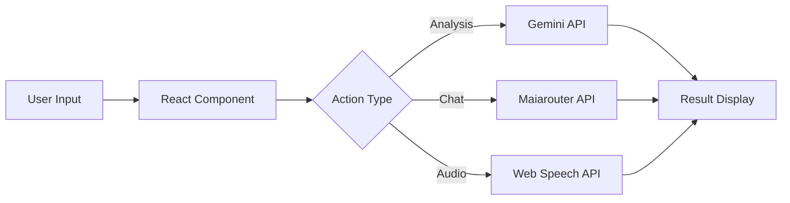

# 📜 Product Specification Document
## Mahir Arab Gundul

**Version:** 1.0.0  
**Author:** 24 Learning Centre  
**Last Updated:** 21 Desember 2025  
**Status:** Production Ready

---

## 📌 Executive Summary

**Mahir Arab Gundul** adalah platform pembelajaran Bahasa Arab berbasis AI yang dirancang untuk membantu pengguna mempelajari tata bahasa Arab (Nahwu & Sharaf) secara interaktif dan komprehensif. Platform ini menggabungkan teknologi AI modern dengan konten kitab klasik untuk memberikan pengalaman belajar yang efektif dan menyenangkan.

### Target Pengguna
- **Pemula**: Santri atau pelajar yang baru memulai belajar Bahasa Arab
- **Menengah**: Mahasiswa bahasa Arab yang ingin memperdalam pemahaman
- **Lanjut**: Pengajar atau peneliti yang membutuhkan tools analisis
- **Self-Learner**: Individu yang belajar secara mandiri

---

## 🎯 Visi & Misi

### Visi
Menjadi platform pembelajaran Bahasa Arab terdepan yang menggabungkan tradisi ilmu klasik dengan teknologi AI modern.

### Misi
1. Memudahkan akses kitab-kitab klasik untuk dipelajari
2. Menyediakan tools analisis gramatikal berbasis AI
3. Membuat pembelajaran Bahasa Arab lebih interaktif dan menyenangkan
4. Mendukung hafalan dan pemahaman dengan fitur-fitur pintar

---

## 🛠️ Tech Stack

### Frontend
| Technology | Version | Purpose |
|------------|---------|---------|
| React | 18.3.1 | UI Framework |
| TypeScript | 5.5.3 | Type Safety |
| Vite | 7.2.4 | Build Tool |
| Tailwind CSS | 3.4.3 | Styling |
| Lucide React | 0.263.1 | Icons |
| React Router | 7.9.6 | Navigation |

### Backend & Services
| Service | Purpose |
|---------|---------|
| Supabase | Authentication & Database |
| Google Gemini API | AI Text Analysis |
| Maiarouter API | AI Assistant |
| Web Speech API | Speech Recognition & TTS |
| Midtrans | Payment Gateway |

### Deployment
| Platform | Purpose |
|----------|---------|
| Cloudflare Pages | Hosting |
| Cloudflare Workers | Edge Functions |

---

## ✨ Fitur Produk

### 1. 🔍 Analisis Teks Arab (AI-Powered)

#### Deskripsi
Fitur utama untuk menganalisis teks Arab secara mendalam menggunakan AI, menghasilkan:

| Feature | Description |
|---------|-------------|
| **Analisis I'rab** | Tata bahasa lengkap dengan terjemahan Indonesia |
| **Analisis Sharaf** | Morfologi dan struktur kata |
| **Teks Bervokal** | Pemberian harakat lengkap pada kitab gundul |
| **Analisis Balaghah** | Retorika dan keindahan bahasa Arab |

#### User Flow
```
Input Teks → Pilih Jenis Analisis → Proses AI (15-30 detik) → Tampilkan Hasil → Export
```

#### Export Options
- **Markdown** (.md) - Untuk catatan digital
- **Plain Text** (.txt) - Format sederhana
- **Document** (.doc) - Untuk editing lanjutan

#### Contoh Teks Tersedia
- Al-Quran (ayat-ayat pilihan)
- Hadits (nabawi)
- Amtsal (peribahasa Arab)
- Kalimat Sederhana (latihan)

---

### 2. 📚 Kitab Digital

#### Koleksi Kitab

| Kitab | Kategori | Bab | Bait/Baris | Level | Fitur Tambahan |
|-------|----------|-----|------------|-------|----------------|
| **Alfiyyah Ibn Malik** | Nahwu & Sharaf | 8 | 57 | Menengah-Lanjut | Terjemahan + 18 Footnotes |
| **Al-Ajurrumiyyah** | Nahwu | 12 | 52 | Pemula-Menengah | Terjemahan + 8 Footnotes |
| **Nazham Al-Imriti** | Sharaf | 8 | 34 | Menengah | Teks Arab |
| **Qawaid al-Lughah** | Qawaid | 15 | 50 | Dasar-Menengah | Teks Arab |
| **Total** | - | **43** | **193** | - | - |

#### Fitur Interaktif

##### Kontrol Tampilan
| Control | Range | Default |
|---------|-------|---------|
| Ukuran Teks | 16px - 36px | 24px |
| Toggle Terjemahan | On/Off | On |
| Toggle Footnotes | On/Off | On |

##### Fitur per Bait (Hover Actions)
- 📋 **Salin**: Copy teks Arab ke clipboard
- 🔖 **Bookmark**: Simpan untuk dibaca nanti (persistent di localStorage)
- ✨ **Highlight**: Beri tanda kuning pada bait penting

##### Navigasi
- Sidebar bab (sticky, dengan highlight aktif)
- Tombol Previous/Next Chapter
- Search bar untuk filter kitab

#### Color Coding
| Warna | Penggunaan |
|-------|------------|
| 🟨 **Amber** | Aksen utama, highlight, bab aktif |
| 🟦 **Sky/Biru** | Box terjemahan |
| 🟪 **Purple/Ungu** | Box footnotes/catatan kaki |
| 🟡 **Kuning** | Highlight manual user |
| ⬜ **Slate** | Background & teks |

---

### 3. 🤖 Asisten AI

#### Deskripsi
Chat interaktif dengan AI expert Bahasa Arab untuk tanya-jawab seputar:
- Grammar (Nahwu)
- Morfologi (Sharaf)
- Penjelasan istilah
- Konteks penggunaan

#### Fitur
- Real-time chat interface
- Riwayat percakapan tersimpan
- Format jawaban dengan markdown (bold, heading, code)
- Blockquotes untuk kutipan Arab

#### Contoh Pertanyaan
- "Apa itu I'rab?"
- "Jelaskan tentang Fi'il Madhi"
- "Bagaimana cara menentukan I'rab isim?"
- "Apa perbedaan Jumlah Ismiyyah dan Fi'liyyah?"

---

### 4. 🎙️ AI Audio Live (Tutor Interaktif)

#### Deskripsi
Fitur percakapan real-time dengan AI tutor menggunakan suara.

#### Capabilities
| Feature | Technology |
|---------|------------|
| Speech Recognition | Web Speech API (Arabic) |
| Text-to-Speech | Web Speech API (Saudi Arabic) |
| Audio Playback | Per-message audio |
| Real-time Processing | Streaming response |

#### Use Cases
- Latihan pelafalan
- Percakapan interaktif
- Listening practice
- Pronunciation feedback

---

### 5. 🌓 Dark Mode Premium

#### Fitur
- Theme switcher dengan animasi smooth
- Gradient design elegan
- Konsisten di semua halaman
- Auto-save preference

---

### 6. 🔐 Authentication & User Management

#### Fitur
- Email/Password login
- Reset password via email
- User session management
- Secure API key storage

#### Provider
- **Supabase Auth** - Authentication service
- Secure token handling
- Email verification

---

### 7. 💳 Payment Integration

#### Provider
- **Midtrans** - Payment gateway Indonesia

#### Supported Methods
- Virtual Account
- E-Wallet (GoPay, OVO, Dana)
- Credit/Debit Card
- Convenience Store

---

## 📱 Responsive Design

### Breakpoints
| Device | Layout |
|--------|--------|
| **Desktop (lg+)** | Grid 4 kolom, sidebar sticky |
| **Tablet (md)** | Grid 2 kolom, collapsible sidebar |
| **Mobile** | Single column, bottom navigation |

### Mobile Optimizations
- Touch-friendly buttons (min 44px)
- Font size 16px minimum (prevent zoom)
- Swipe gestures untuk navigasi
- Compact toolbar

---

## 🔧 Technical Architecture

### File Structure
```
src/
├── components/          # React Components
│   ├── AiAssistantTab.tsx
│   ├── AnalysisTab.tsx
│   ├── AnalysisResultDisplay.tsx
│   ├── ApiKeySettings.tsx
│   ├── CheckoutButton.tsx
│   ├── Footer.tsx
│   ├── Header.tsx
│   ├── KitabTab.tsx
│   ├── LiveTutorTab.tsx
│   ├── Login.tsx
│   └── ...
├── contexts/            # React Context (Theme)
├── data/                # Kitab Data (Static)
├── services/            # API Services
├── pages/               # Page Components
├── hooks/               # Custom Hooks
└── types.ts             # TypeScript Types
```

### Data Flow


---

## 📊 Performance Metrics

### Target KPIs
| Metric | Target | Measurement |
|--------|--------|-------------|
| First Contentful Paint | < 1.5s | Lighthouse |
| Largest Contentful Paint | < 2.5s | Lighthouse |
| Time to Interactive | < 3s | Lighthouse |
| Cumulative Layout Shift | < 0.1 | Lighthouse |
| AI Response Time | < 30s | App Monitoring |

### Optimizations
- LocalStorage for bookmarks (instant load)
- Lazy loading for large content
- Efficient state management
- CDN via Cloudflare

---

## ♿ Accessibility

### Compliance
- Semantic HTML5
- ARIA labels
- Keyboard navigation
- Screen reader friendly
- High contrast ratios (WCAG 2.1 AA)

---

## 🔒 Security

### Measures
| Area | Implementation |
|------|----------------|
| API Keys | Environment variables, not exposed |
| Authentication | Supabase Auth (JWT tokens) |
| Data Transfer | HTTPS only |
| Payment | PCI-DSS compliant (Midtrans) |

### Best Practices
- `.env` file untuk sensitive data
- Git-ignored credentials
- Server-side API calls untuk sensitive operations
- Rate limiting

---

## 🚀 Deployment

### Platform: Cloudflare Pages

#### Build Command
```bash
npm run build:cloudflare
```

#### Environment Variables Required
```
VITE_GEMINI_API_KEY=<google_ai_key>
VITE_MAIAROUTER_URL=<maiarouter_endpoint>
VITE_MIDTRANS_CLIENT_KEY=<midtrans_key>
VITE_SUPABASE_URL=<supabase_url>
VITE_SUPABASE_ANON_KEY=<supabase_anon_key>
```

---

## 📈 Roadmap (Future Features)

### Planned Enhancements
- [ ] 🎵 Audio recitation untuk setiap bait
- [ ] 📝 Quiz interaktif per bab
- [ ] 📊 Progress tracking (% selesai per kitab)
- [ ] 📄 Export bookmark ke PDF
- [ ] 📒 Catatan pribadi per bookmark
- [ ] 📖 Hasyiah (syarah) dari berbagai ulama
- [ ] 🔍 Pencarian dalam konten kitab
- [ ] 🌐 Perbandingan terjemahan dari berbagai sumber
- [ ] 🏆 Gamification (badges, streaks)
- [ ] 👥 Fitur komunitas dan forum

---

## 📞 Support & Contact

**Developer:** 24 Learning Centre  
**Website:** [mahirarab.com](https://mahirarab.com)  
**Repository:** [GitHub](https://github.com/hafarna03aja-droid/mahir-kitab-gundul)

---

## 📋 Document History

| Version | Date | Changes |
|---------|------|---------|
| 1.0.0 | 21 Des 2025 | Initial Product Specification |

---

> **"من سلك طريقا يلتمس فيه علما سهل الله له به طريقا إلى الجنة"**  
> *Made with ❤️ for Arabic learners worldwide*
