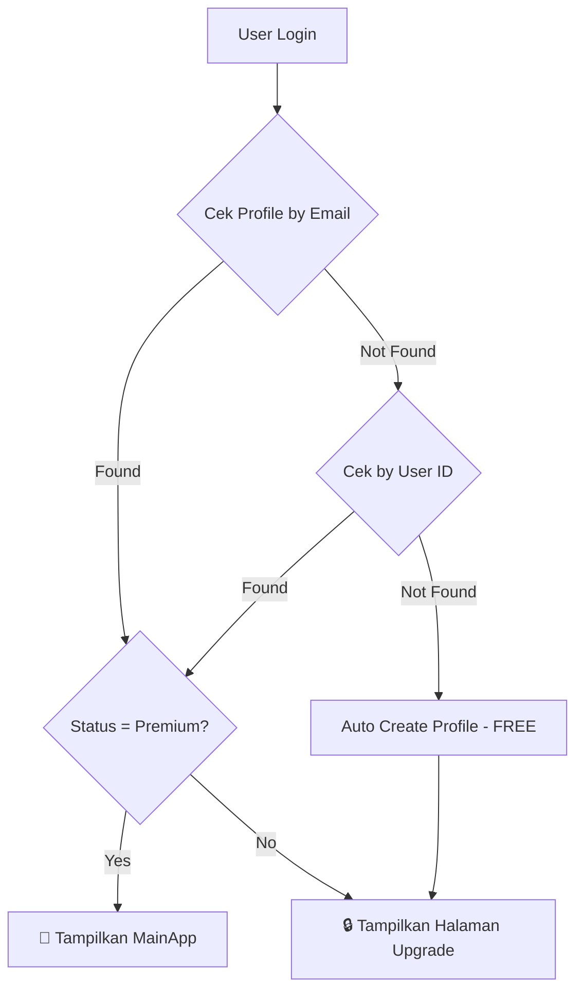

# 📱 Alur Pengguna Mahir Arab Gundul

**Dokumentasi lengkap perjalanan user dari Landing Page hingga sukses masuk aplikasi**

---

## 🗺️ Ringkasan Alur

```mermaid
flowchart TD
    A[🌐 Landing Page] --> B{Klik "Ambil Promo Sekarang"}
    B --> C[📧 Modal Input Email]
    C --> D{Klik "Lanjut ke Pembayaran"}
    D --> E[💳 Midtrans Payment Popup]
    E --> F{Pilih Metode Pembayaran}
    F --> G[Proses Pembayaran]
    G --> H{Status Pembayaran}
    H -->|Success| I[✅ Modal Sukses + Buat Password]
    H -->|Pending| I
    H -->|Close| I
    I --> J{Buat Akun atau Login?}
    J -->|Buat Akun| K[Input Password → Auto Signup]
    J -->|Sudah Punya Akun| L[Redirect ke /app → Login]
    K --> M[🎉 Redirect ke Aplikasi]
    L --> N[📝 Halaman Login]
    N --> O[Input Email + Password]
    O --> P{Verifikasi}
    P -->|Premium| M
    P -->|Free| Q[Halaman Upgrade/Cek Status]
    Q --> R[Klik "Cek Status Pembayaran"]
    R --> P
```

---

## 📍 Langkah Detail

### 1️⃣ Landing Page (`/`)

**File:** [LandingPage.tsx](file:///d:/aplikasi%20mahir%20arab/src/pages/LandingPage.tsx)

User mengakses halaman utama di `mahirarab.web.id` dan melihat:

- **Navbar** dengan menu: Fitur, Harga, FAQ, Login Member
- **Hero Section** dengan headline dan tombol CTA
- **Problem Section** - masalah yang sering dialami pengguna
- **Solution Section** - pengenalan Mahir Arab Gundul
- **Features Section** - fitur-fitur aplikasi
- **Pricing Section** - harga dan benefit
- **FAQ Section** - pertanyaan yang sering diajukan
- **Footer** dengan CTA tambahan

#### Opsi User:
| Aksi | Hasil |
|------|-------|
| Klik **"Ambil Promo Sekarang"** | Buka modal input email |
| Klik **"Login Member"** | Redirect ke `/app` (halaman login) |
| Scroll ke section | Navigasi smooth scroll |

---

### 2️⃣ Modal Input Email

**File:** [CheckoutButton.tsx](file:///d:/aplikasi%20mahir%20arab/src/components/CheckoutButton.tsx#L409-L492) (lines 409-492)

Setelah klik tombol "Ambil Promo Sekarang", muncul modal:

![Modal Input Email]

**Elemen Modal:**
- 📧 Input field untuk email
- 💰 Tampilan harga: **Rp 1.000** (Lifetime Access)
- ✅ Tombol "Lanjut ke Pembayaran"
- ❌ Tombol close (X)

#### Validasi:
- Email harus valid (mengandung `@`)
- Koneksi internet harus tersedia

#### Opsi User:
| Aksi | Hasil |
|------|-------|
| Input email + Klik **"Lanjut ke Pembayaran"** | Buka Midtrans Snap |
| Klik **X** atau area luar | Tutup modal |
| Tekan **Enter** | Submit (sama seperti klik tombol) |

---

### 3️⃣ Midtrans Payment Popup

**Library:** Midtrans Snap Popup

Setelah email valid, sistem:
1. Memanggil API `/api/payment` untuk membuat transaksi
2. Mendapatkan `snap_token` dari Midtrans
3. Membuka popup payment Midtrans

#### Metode Pembayaran Tersedia:
| Kategori | Opsi |
|----------|------|
| **E-Wallet** | GoPay, ShopeePay, DANA, OVO, LinkAja |
| **Virtual Account** | BCA, BNI, BRI, Mandiri, Permata, dll |
| **Retail** | Alfamart, Indomaret |
| **Kartu Kredit/Debit** | Visa, Mastercard, JCB |
| **QRIS** | Scan QR dari aplikasi banking |

#### Alur di Midtrans:
1. Pilih metode pembayaran
2. Ikuti instruksi sesuai metode
3. Selesaikan pembayaran

#### Callback Status:
| Status | Handling |
|--------|----------|
| **onSuccess** | Simpan ke localStorage, trigger webhook, tampilkan modal sukses |
| **onPending** | Simpan status pending, trigger webhook, tampilkan modal sukses |
| **onError** | Tampilkan alert error |
| **onClose** | Tampilkan modal sukses (untuk cek status) |

---

### 4️⃣ Modal Sukses + Buat Password

**File:** [CheckoutButton.tsx](file:///d:/aplikasi%20mahir%20arab/src/components/CheckoutButton.tsx#L494-L590) (lines 494-590)

Setelah pembayaran (success/pending/close), muncul modal sukses:

**Elemen Modal:**
- ✅ Icon sukses hijau
- 🎉 Heading "Pembayaran Berhasil!"
- 📧 Email yang digunakan
- 🔐 Form buat password (minimal 6 karakter)
- 👁️ Toggle show/hide password
- ✨ Tombol "Buat Akun & Masuk"
- 📍 Link "Sudah punya akun? Login"

#### Opsi User:
| Aksi | Hasil |
|------|-------|
| Input password + Klik **"Buat Akun & Masuk"** | Auto signup → Redirect ke aplikasi |
| Klik **"Sudah punya akun? Login"** | Redirect ke `/app` |

#### Proses Signup:
1. Cek apakah profile sudah ada (dari webhook)
2. Buat akun di Supabase Auth
3. Link profile dengan user ID
4. Redirect ke `/app` (aplikasi)

---

### 5️⃣ Halaman Login (`/app`)

**File:** [Login.tsx](file:///d:/aplikasi%20mahir%20arab/src/components/Login.tsx)

Jika user belum login, tampil halaman login:

**Elemen:**
- 📧 Input email
- 🔐 Input password
- 👁️ Toggle show/hide password
- 🔑 Link "Lupa Password?"
- ✨ Tombol "Masuk" / "Daftar Sekarang"
- 🔄 Toggle antara Login/Signup
- 👁️ Tombol "Preview Mode (Tanpa Login)"
- 💡 Info box untuk user yang sudah bayar

#### Mode Form:
| Mode | Fungsi |
|------|--------|
| **Login** | Masuk dengan email + password |
| **Signup** | Daftar akun baru |
| **Forgot Password** | Kirim link reset password |

#### Opsi User:
| Aksi | Hasil |
|------|-------|
| Login dengan akun premium | Masuk ke aplikasi utama |
| Login dengan akun free | Tampil halaman upgrade |
| Signup dengan email yang sudah bayar | Profile di-link, masuk sebagai premium |
| Signup dengan email baru | Buat akun free |
| Klik "Preview Mode" | Lihat aplikasi tanpa login (terbatas) |
| Klik "Lupa Password" | Kirim email reset password |

---

### 6️⃣ Dashboard Check (`/app` - Authenticated)

**File:** [DashboardApp.tsx](file:///d:/aplikasi%20mahir%20arab/src/DashboardApp.tsx)

Setelah login berhasil, sistem cek status profile:

#### Flow Check Profile:


#### Jika Status FREE:
Tampil halaman "Akses Premium Diperlukan" dengan:
- 🔒 Icon gembok
- ℹ️ Info status akun FREE
- 🔄 Tombol "Cek Status Pembayaran"
- 💳 Link "Lakukan Pembayaran"
- 🚪 Tombol "Logout"

#### Auto-Check:
- Sistem auto-check setiap 5 detik (max 10x = 50 detik)
- Berhenti jika status berubah ke premium

---

### 7️⃣ Aplikasi Utama (Premium Only)

**File:** [MainApp.tsx](file:///d:/aplikasi%20mahir%20arab/src/components/MainApp.tsx)

Jika status = premium, user masuk ke aplikasi dengan akses penuh:
- 🎉 Welcome message "Member Premium"
- 📚 Semua fitur AI tersedia
- 📖 Akses perpustakaan kitab digital
- 🤖 AI Assistant 24 jam

---

## 🔄 Skenario Alur Lengkap

### Skenario A: User Baru (Bayar Dulu)
```
Landing Page → Klik CTA → Input Email → Bayar → Modal Sukses → Buat Password → Auto Signup → Aplikasi Premium ✅
```

### Skenario B: User Baru (Signup Dulu, Bayar Nanti)
```
Landing Page → Login Member → Daftar → Verifikasi Email → Login → Halaman Upgrade → Bayar di Landing Page → Cek Status → Aplikasi Premium ✅
```

### Skenario C: User Existing (Sudah Bayar)
```
Landing Page → Login Member → Login → Cek Status (auto) → Aplikasi Premium ✅
```

### Skenario D: User Payment Pending
```
Bayar (status pending) → Modal Sukses → Buat Akun → Login → Halaman Upgrade → Cek Status (manual/auto) → Jika settlement → Aplikasi Premium ✅
```

---

## 🛠️ Technical Flow

### Backend Endpoints:

| Endpoint | Fungsi |
|----------|--------|
| `POST /api/payment` | Buat transaksi Midtrans |
| `POST /api/webhook` | Handle callback Midtrans |
| `GET /api/health` | Health check |

### Database (Supabase):

**Tabel `profiles`:**
| Field | Deskripsi |
|-------|-----------|
| `id` | User ID dari Supabase Auth |
| `email` | Email user |
| `status` | `free` atau `premium` |
| `subscription_expires_at` | Tanggal expired (lifetime = null) |

**Tabel `orders`:**
| Field | Deskripsi |
|-------|-----------|
| `order_id` | ID unik transaksi |
| `email` | Email pembeli |
| `gross_amount` | Total pembayaran |
| `transaction_status` | `pending`, `settlement`, `expire`, dll |
| `payment_type` | Metode pembayaran |

---

## 📱 Responsive Design

Aplikasi mendukung:
- 📱 Mobile (responsive)
- 💻 Desktop
- 📟 Tablet

---

## ❓ FAQ Teknis

### Q: Bagaimana jika webhook gagal?
**A:** User bisa klik "Cek Status Pembayaran" untuk manual check. Sistem akan auto-check 10x setiap 5 detik.

### Q: Bagaimana jika email berbeda antara bayar dan signup?
**A:** Status akan tetap FREE. User harus menggunakan email yang sama saat bayar.

### Q: Berapa lama proses konfirmasi?
**A:** Biasanya instant via webhook. Max 1-2 menit untuk kasus edge.

---

*Dokumentasi ini dibuat berdasarkan analisis kode pada 13 Desember 2024*
